# Local Historia 0.16.0

Local Historia는 시나리오 데이터, 구조화된 외교 상태, LLM 기반 사건 생성, 지도·외교 효과 검증을 결합한 로컬 턴제 지정학·외교 시뮬레이션입니다.

이 문서는 현재 디렉터리 구조의 기준과 각 기능에서 실제로 실행되는 코드·프롬프트 모듈의 순서를 기록합니다. 프롬프트 레지스트리의 나열 순서와 런타임 호출 순서는 서로 다르므로 별도로 설명합니다.

## 실행

요구 사항은 Node.js 20 이상입니다. 모든 런타임 데이터 경로는 프로젝트 루트를 현재 작업 디렉터리로 가정하므로 아래 명령은 반드시 이 파일이 있는 디렉터리에서 실행합니다.

```text
npm start
```

Windows에서는 `start.bat`, POSIX 환경에서는 `start.sh`를 사용할 수 있습니다. 기본 주소는 `http://localhost:4173`이며, 기본 바인딩은 `0.0.0.0`입니다.

테스트는 다음 명령으로 실행합니다.

```text
npm test
```

활성 게임을 초기 상태로 되돌리는 명령은 다음과 같습니다. 이 명령은 실제 활성 기록을 변경하므로 경로 확인이나 단순 스모크 테스트 용도로 실행하지 않습니다.

```text
npm run reset
```

## 디렉터리 구조

```text
Local Historia/
├─ server.mjs                         HTTP 서버 구현을 불러오는 최소 진입점
├─ package.json
├─ start.bat
├─ start.sh
├─ Readme.md
│
├─ src/
│  ├─ server/
│  │  └─ http-server.mjs              정적 파일·API·스트리밍·저장 조율
│  ├─ runtime/
│  │  ├─ engine.mjs                   행동, 턴, 외교, 비서실, 기록 통합 조율
│  │  ├─ notifications.mjs            도구·외교방 알림 상태
│  │  └─ operation-context.mjs        취소 신호와 작업 범위
│  ├─ core/
│  │  ├─ utils.mjs                    공통 ID, 복제, 날짜, HTTP 유틸리티
│  │  ├─ state-views.mjs              현재 라운드와 상태 조회 함수
│  │  └─ version.mjs                  애플리케이션 이름·버전
│  ├─ actions/
│  │  └─ action-scheduling.mjs        예약·조건부 행동 등록과 물질화
│  ├─ events/
│  │  ├─ event-generation.mjs         구조화 턴 사건 생성 파이프라인
│  │  ├─ event-deduplication.mjs      역사·행동 결과 중복 검사
│  │  └─ effects/
│  │     ├─ effect-engine.mjs         외교·현안·프로젝트·협정 효과 적용
│  │     └─ effect-gates.mjs          근거 없는 효과와 지도 변경 차단
│  ├─ diplomacy/
│  │  ├─ diplomatic-relations.mjs     관계 그래프, 상태 비트, 전쟁·동맹 의무
│  │  ├─ diplomacy-memory.mjs         대화 스냅샷, 공개 범위, 문서·요약
│  │  ├─ diplomacy-workflow.mjs       선택된 외교 행동의 LLM 실행기
│  │  ├─ diplomatic-outcome-events.mjs 제안 없는 외교 대화의 결과 사건화
│  │  ├─ ultimatums.mjs               최후통첩 생성·응답·시한 처리
│  │  └─ agreements/
│  │     ├─ commitments.mjs           협정 revision, 상태, 가시성, 사건 표식
│  │     ├─ commitment-batch.mjs      턴 시작 협정 유지와 표시 현지화
│  │     └─ multilateral-vote.mjs     정보 독립적인 다자 협정 표결
│  ├─ simulation/
│  │  ├─ issues-projects.mjs          외교 현안과 기간형 국가 프로젝트
│  │  └─ strategic-plans.mjs          NPC Active Plan 스캔·예약·진행
│  ├─ world/
│  │  ├─ reducer.mjs                  라운드·지도 변경의 결정론적 반영
│  │  ├─ map-geometry.mjs             시나리오 지도 로딩·변환·캐시
│  │  ├─ region-resolution.mjs        지역 별칭, ID, 모호성 해소
│  │  └─ cheats.mjs                   소유권·지도 포인트 편집
│  ├─ country/
│  │  ├─ country-display.mjs          국가 탭 표시 문자열·현지화 캐시
│  │  └─ country-tab-data.mjs         국가 탭용 협정·현안·프로젝트 읽기 모델
│  ├─ persistence/
│  │  ├─ storage.mjs                  게임 기록, 세이브, 체크포인트, 설정 저장
│  │  └─ scenarios.mjs                시나리오 발견·검증·가져오기·활성화
│  ├─ llm/
│  │  ├─ runtime.mjs                  모델 호출, schema 파싱·복구, 사용량 기록
│  │  └─ providers.mjs                provider 설정, 모델 탐색, 비밀값 처리
│  ├─ observability/
│  │  ├─ debug-trace.mjs              단계별 입력·출력·LLM 추적 기록
│  │  └─ gpu-telemetry.mjs            NVIDIA GPU 상태 조회
│  └─ prompts/
│     ├─ runtime.mjs                  상태 컨텍스트 구성, override 병합, 렌더링
│     ├─ registry.mjs                 28개 영속 stage와 프롬프트 모듈 등록
│     ├─ actions/                     행동 설명 구체화
│     ├─ advisor/                     비서실
│     ├─ history/                     사건 기록 통합
│     ├─ world/resolution/            국가·지역 식별
│     ├─ turn/
│     │  ├─ actions/                  행동·시스템 지시·조건부 행동 결과
│     │  ├─ events/                   국제 사건 계획·상세화
│     │  ├─ reactions/                국가별 반응 판단·상세화
│     │  └─ resolution/               지도 변경 GameMaster 검증
│     └─ diplomacy/
│        ├─ workflow/                 일반 외교 행동별 응답
│        ├─ agreements/               다자 협정 표결
│        ├─ ultimatums/               최후통첩 응답·연장 판단
│        └─ outreach/                  사건 후속 외교 연락
│
├─ public/
│  ├─ index.html                      정적 HTML 진입점
│  ├─ css/styles.css                  전체 UI 스타일
│  └─ js/
│     ├─ app.js                       브라우저 상태·API·화면 조율
│     └─ ui-helpers.js                지도·날짜·레이아웃 순수 함수
│
├─ scripts/
│  ├─ maintenance/reset.mjs           활성 기록 초기화
│  └─ scenario-data/                  오프라인 시나리오 데이터 생성 도구
├─ data/
│  ├─ config/                         provider와 전역 설정
│  ├─ runtime/                        활성 시나리오·활성 게임 포인터
│  └─ schemas/                        구조화 출력 schema
├─ scenarios/                         설치된 시나리오 팩
├─ game-records/                      게임별 상태·외교·프롬프트 override·추적
└─ tests/                             기능·회귀·UI 소스 계약 테스트
```

`data/`, `scenarios/`, `game-records/`는 저장 형식과 시나리오 계약에 직접 연결되어 있으므로 코드 디렉터리 재분류 대상이 아닙니다. 시나리오의 `world.json`에 있는 `worldPrompt`와 `introPrompt`도 해당 시나리오의 데이터이며 시스템 프롬프트 파일로 이동하지 않습니다.

## 전체 모듈 구조·관계·워크플로우 다이어그램

다이어그램의 화살표는 다음 의미로 통일합니다.

- `-->`: 직접 ESM import, 동기 호출 또는 다음 실행 단계
- `==>`: 브라우저와 서버 사이의 HTTP·NDJSON 런타임 통신
- `-.->`: 등록, 선택적 호출, 관측 또는 디스크 입출력처럼 간접적인 관계
- `-->>`: sequence diagram에서 호출 결과의 반환

관계도와 순서도는 화살표의 의미가 다릅니다. 관계도는 모듈이 어떤 모듈을 직접 참조하는지를 나타내고, 순서도는 같은 모듈이 런타임에 어떤 순서로 실행되는지를 나타냅니다. 선이 겹쳐 의미가 사라지는 것을 막기 위해 전체 모듈을 기반·턴·외교·프롬프트 관계도로 나누고, 실행 흐름은 별도의 순서도로 표시합니다.

도식 범위는 `src/**/*.mjs` 64개 전체입니다. 이 중 기능 모듈은 34개이고, 프롬프트 계층은 `runtime.mjs`, `registry.mjs`, 템플릿 28개로 구성됩니다. 여기에 루트 진입점, 브라우저 자산 4개, 유지보수·시나리오 생성 스크립트 2개, 영속 데이터 경계를 함께 표시합니다.

### 1. 전체 아키텍처 계층

다음 그림은 폴더별 직접 import를 집계한 전체 구조입니다. `public/js/app.js`와 서버 사이는 JavaScript import가 아니라 HTTP·NDJSON 통신입니다.

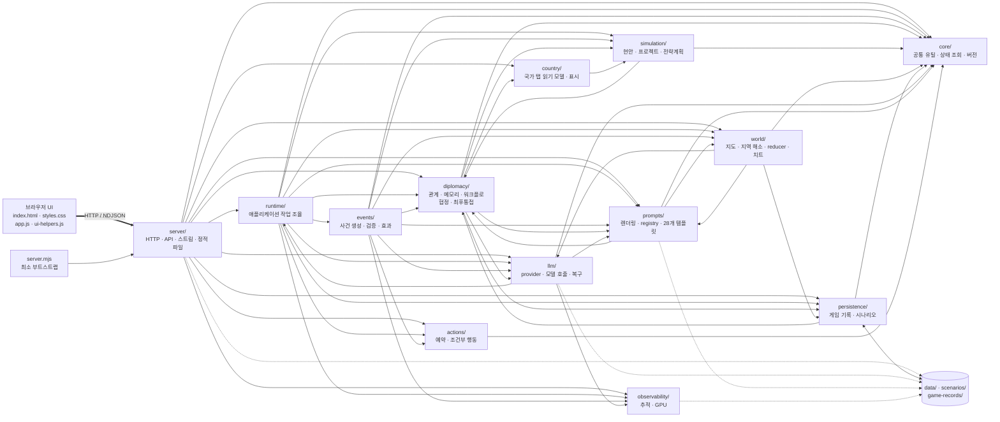

### 2. 진입점·기반 모듈 관계도

`server/http-server.mjs`는 HTTP 경계이기 때문에 많은 모듈을 직접 가져옵니다. 이 그림은 서버, 공통 기반, 저장소, 표시, LLM, 관측 모듈의 실제 직접 import 관계를 표시합니다.

```mermaid
flowchart TB
  Start["npm start · start.bat · start.sh"] --> RootServer["server.mjs"]
  RootServer --> Http["server/http-server.mjs"]

  subgraph Client["public/ 브라우저 자산"]
    Html["index.html"] --> Css["css/styles.css"]
    Html --> App["js/app.js"]
    App --> Helpers["js/ui-helpers.js"]
  end
  App ==>|"fetch · NDJSON"| Http

  subgraph RuntimeBase["runtime/"]
    Engine["engine.mjs"]
    Notify["notifications.mjs"]
    OpCtx["operation-context.mjs"]
  end

  subgraph CoreBase["core/"]
    Utils["utils.mjs"]
    Views["state-views.mjs"]
    Version["version.mjs"]
    Views --> Utils
  end

  subgraph PersistenceBase["persistence/"]
    Storage["storage.mjs"]
    Scenarios["scenarios.mjs"]
    Storage --> Scenarios
    Storage --> Utils
    Storage --> Version
    Scenarios --> Utils
  end
  StorageMemory["diplomacy/diplomacy-memory.mjs"]
  Storage --> StorageMemory

  subgraph CountryBase["country/"]
    CountryTab["country-tab-data.mjs"] --> CountryDisplay["country-display.mjs"]
  end
  CountryIssues["simulation/issues-projects.mjs"]
  CountryTab --> CountryIssues

  subgraph LLMBase["llm/"]
    LLMRuntime["runtime.mjs"] --> Providers["providers.mjs"]
  end

  subgraph ObserveBase["observability/"]
    Trace["debug-trace.mjs"]
    GPU["gpu-telemetry.mjs"]
  end

  PromptRuntime["prompts/runtime.mjs"]
  LLMRuntime --> OpCtx
  LLMRuntime --> Utils
  LLMRuntime --> Views
  LLMRuntime --> PromptRuntime
  LLMRuntime --> Trace
  Providers --> Utils
  MapGeometry["world/map-geometry.mjs"] --> Scenarios
  Cheats["world/cheats.mjs"] --> Views
  Cheats --> Utils
  Scheduling["actions/action-scheduling.mjs"] --> Views
  Scheduling --> Utils
  Commitments["diplomacy/agreements/commitments.mjs"] --> Views
  Commitments --> Utils
  Ultimatums["diplomacy/ultimatums.mjs"]

  Http --> Engine
  Http --> Notify
  Http --> OpCtx
  Http --> Utils
  Http --> Views
  Http --> Version
  Http --> Storage
  Http --> Scenarios
  Http --> CountryTab
  Http --> CountryDisplay
  Http --> LLMRuntime
  Http --> Providers
  Http --> PromptRuntime
  Http --> Trace
  Http --> GPU
  Http --> MapGeometry
  Http --> Cheats
  Http --> Scheduling
  Http --> Commitments
  Http --> Ultimatums
```

### 3. 턴·사건·세계 모듈 관계도

다음 그림에서 `runtime/engine.mjs`는 애플리케이션 조정자이고, `events/event-generation.mjs`는 턴 내부 사건 생성 조정자입니다. 공통 `core` 의존은 하나의 노드로 묶었지만, 기능 모듈은 모두 개별 표시합니다.

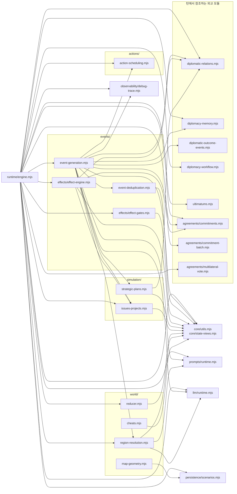

### 4. 외교·협정 모듈 관계도

외교의 대화 기록, 관계 상태, 협정 revision, LLM 워크플로는 서로 역할이 다릅니다. 메시지 원문은 `diplomacy-memory`, 기계적 관계 상태는 `diplomatic-relations`, 협정 revision은 `agreements/commitments`가 각각 소유합니다.

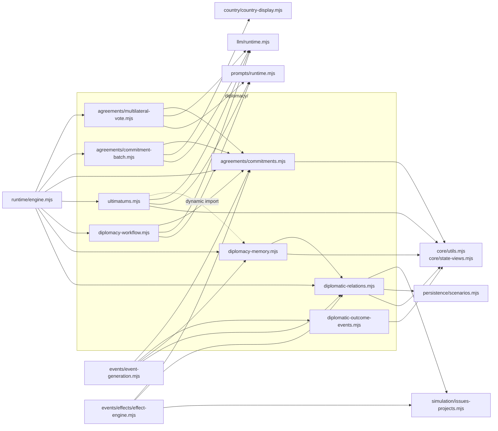

### 5. 실제 ESM 순환 의존성

폴더 단위 관계가 양방향이라고 해서 모두 순환 import인 것은 아닙니다. 실제로 하나의 강결합 순환을 이루는 파일은 아래 세 개뿐입니다. 이 때문에 배럴 `index.mjs`를 추가해 평가 순서를 바꾸면 안 됩니다.

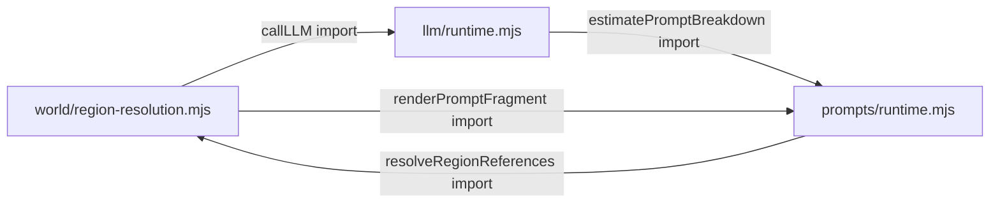

### 6. 루트·브라우저·유지보수 스크립트 관계도

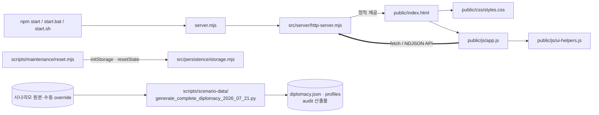

### 7. 프롬프트 모듈 전체 구조와 실제 호출자

`prompts/registry.mjs`의 배열은 편집기 표시와 기본 설정을 위한 **등록 순서**입니다. 28개 프롬프트를 차례로 실행하는 워크플로가 아닙니다. 실제 실행 순서는 `runtime/engine.mjs`, `events/event-generation.mjs`, 외교 모듈, 지역 해소 모듈의 분기에서 결정됩니다. 각 템플릿은 `stage`, `label`, `group`, `template`, `templateHelpers`, `config`를 내보내고, `prompts/runtime.mjs`가 게임별 override와 컨텍스트를 합쳐 렌더링합니다.

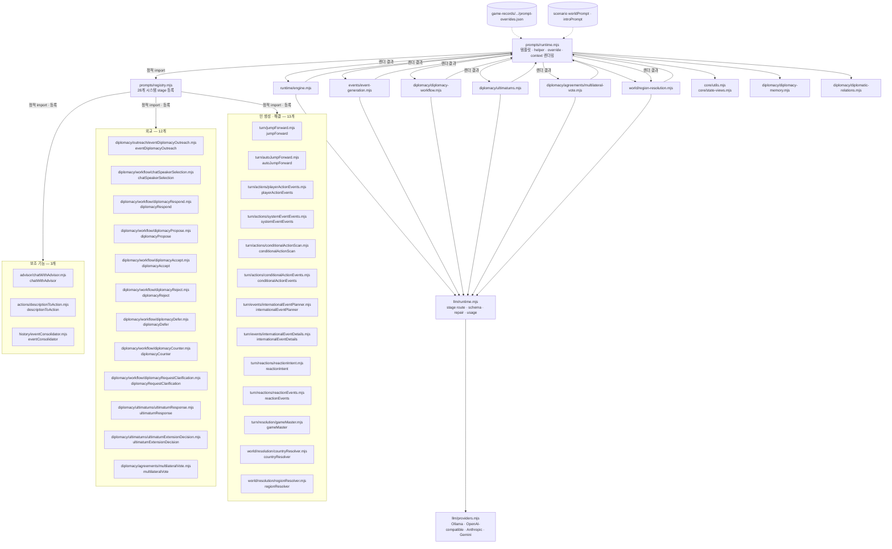

`jumpForward`는 별도 LLM 호출이 아니라 시스템 사건, 플레이어 행동, 국제 사건 상세화 프롬프트의 공통 기반입니다. 반대로 `gameMaster`는 지도 변화 신호가 있는 사건마다 선택적으로 호출됩니다. `commitment-batch.mjs`의 국가 탭 현지화는 호환성을 위해 `gameMaster` stage route만 재사용하며 `gameMaster.mjs` 템플릿 자체는 사용하지 않습니다.

다음 관계도는 각 stage를 실제로 선택하는 호출자를 압축해 표시합니다. `chatSpeakerSelection` 뒤에서는 7개 외교 workflow 중 정확히 하나만 실행됩니다.

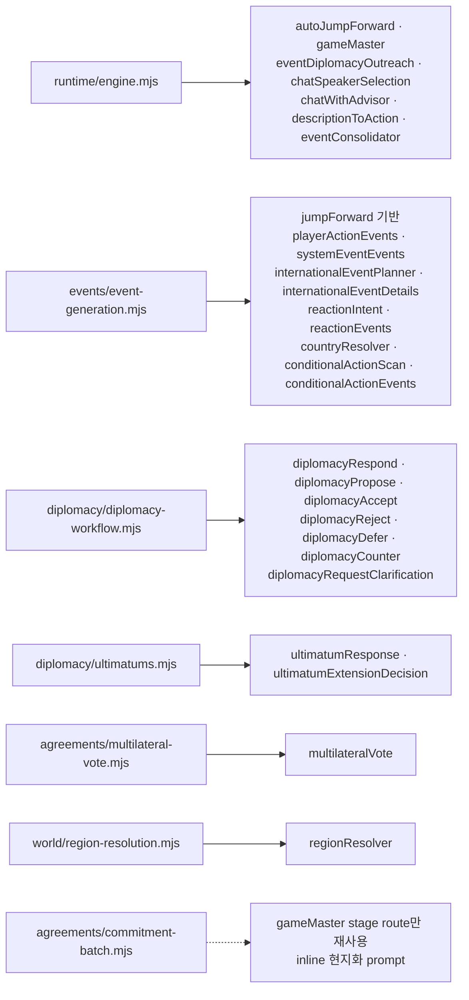

### 8. 서버 시작과 브라우저 초기화 순서

정적 ESM import는 서버가 저장소를 초기화하기 전에 평가됩니다. 그 과정에서 엔진, 사건 생성기, 프롬프트 registry와 28개 프롬프트 템플릿도 함께 로드됩니다.

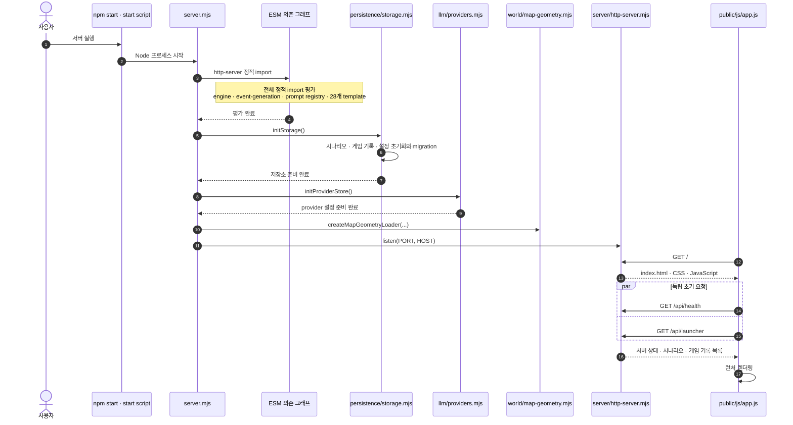

게임을 새로 만들거나 기존 기록을 활성화한 뒤, 브라우저는 핵심 읽기 모델을 병렬로 불러오고 프롬프트·라우팅 정보를 추가로 동기화합니다.

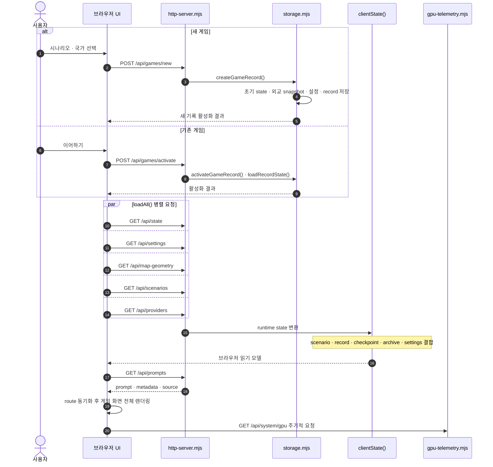

### 9. 일반 턴의 최상위 실행 순서

일반 턴은 먼저 **실제 state**에서 협정·예약 행동·최후통첩을 정리한 뒤 state를 복제합니다. LLM 사건 생성과 중간 효과는 **working state**에서 해결하고, 마지막에 검증된 사건을 실제 state에 다시 커밋합니다. 두 state의 경계를 합치면 중간 생성 컨텍스트와 영구 저장 시점을 오해하게 되므로 아래처럼 분리합니다.

```mermaid
flowchart TB
  UIAdvance["UI: 턴 진행"] ==> TurnAPI["POST /api/turn<br/>또는 /api/turn/stream"]
  TurnAPI --> LoadTurn["state · settings · active record 로드"]
  LoadTurn --> Checkpoint["현재 Round checkpoint 보장"]
  Checkpoint --> TraceTurn["runWithTurnDebugTrace"]
  TraceTurn --> Advance["runtime/engine.advanceTurn"]

  subgraph ActualPre["1. 사전 처리 — 실제 state"]
    Advance --> DateCheck["목표 날짜 · 달력 · 순방향 검증"]
    DateCheck --> CommitmentBatchFlow["processCommitmentsForTurn<br/>lifecycle 유지 · 필요 시 표시 현지화"]
    CommitmentBatchFlow --> Scheduled["materializeDueScheduledActions"]
    Scheduled --> UltProcess["processUltimatumsForTurn"]
    UltProcess --> UltPending["pendingUltimatumEvents 기록"]
  end

  UltPending --> CloneState["실제 state clone → workingState"]
  CloneState --> GenerateTurn["events/event-generation.generateStructuredTurn"]

  subgraph ActualCommit["2. 최종 반영 — 실제 state"]
    GenerateTurn --> CopyRuntime["usage · 전략계획 · scheduling · ultimatum 일부 복사"]
    CopyRuntime --> ApplyEvents["world/reducer.applyEvents"]
    ApplyEvents --> ApplyEffectsFinal["모든 사건에 applyEventEffects"]
    ApplyEffectsFinal --> AdvanceIssues["현안 · 프로젝트를 목표일까지 전진"]
    AdvanceIssues --> Exposure["사건 노출 기록"]
    Exposure --> CompleteRound["현재 Round completed=true"]
    CompleteRound --> NextRound["다음 Round 생성"]
    NextRound --> RuntimeDates["lastRoundCompleted · currentDate · lastPlayed 갱신"]
    RuntimeDates --> Reconcile["협정 사건화 marker reconcile"]
  end

  Reconcile --> OutreachSort["후속 외교 후보 우선순위 정렬"]
  OutreachSort --> OutreachGuard["직접 상대국 · 지식 · 중복 연락 검사"]
  OutreachGuard --> OutreachCap["후속 연락 최대 2건"]
  OutreachCap --> ClearAdvisor["비서실 Round 대화 초기화"]
  ClearAdvisor --> NotifyTurn["알림 갱신"]
  NotifyTurn --> SaveTurn["persistence/storage.saveState"]
  SaveTurn -->|"완료"| TurnAPI
  TurnAPI ==>|"complete JSON / NDJSON"| UIAdvance
```

### 10. `generateStructuredTurn()` 내부 사건 생성 순서

시스템 사건과 플레이어 행동은 먼저 국가·지역 표현을 정규화한 뒤 각각 사건을 생성합니다. 국제 사건은 뼈대 계획, 지역 정규화, 1차 검증, 두 번의 상세화 배치, 2차 검증 순서입니다. 조건부 행동은 국제 사건과 반응 사건 사이에서 검사됩니다.

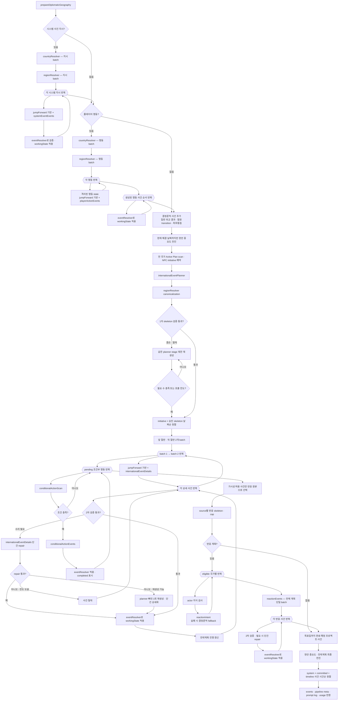

결정론적으로 만든 일반 외교 결과·협정 transition·최후통첩 사건은 위 단계에서 `committedEvents`에 합쳐지지만 즉시 `eventResolver`를 통과하지 않습니다. 최종 실제 state 커밋에서 효과가 적용됩니다. 국제 사건 상세화는 batch 1 해결 결과를 batch 2의 추가 컨텍스트로 사용합니다.

### 11. 사건 한 건의 검증·즉시 적용과 최종 커밋

일반 턴의 생성 사건 한 건은 효과 gate 3개를 순서대로 통과합니다. 지도 변화가 포함된 경우에만 `gameMaster` 검증이 추가되고, 승인된 지도 변화와 사건 효과가 working state에 즉시 반영됩니다.

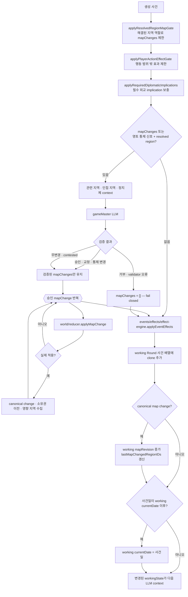

working state 객체 전체를 최종 상태로 교체하지 않습니다. 엔진은 검증 완료된 사건 배열을 받아 실제 state에 지도 변화를 재적용하고, 사건별 효과도 다시 실제 state에 적용합니다.

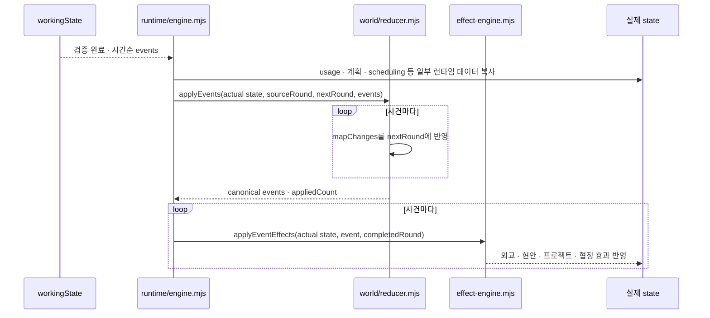

### 12. 일반 외교와 다자 합의의 실행 분기

플레이어 외교 메시지는 먼저 대화방과 메시지를 기록하고, 구조화된 협정 행동이 있으면 기계 상태에 적용합니다. 플레이어가 제안한 참가국 3개 이상의 다자 합의만 별도 표결 경로로 빠집니다. 그 외에는 `chatSpeakerSelection`이 발언자와 workflow를 함께 고른 뒤 7개 workflow 중 하나만 실행합니다.

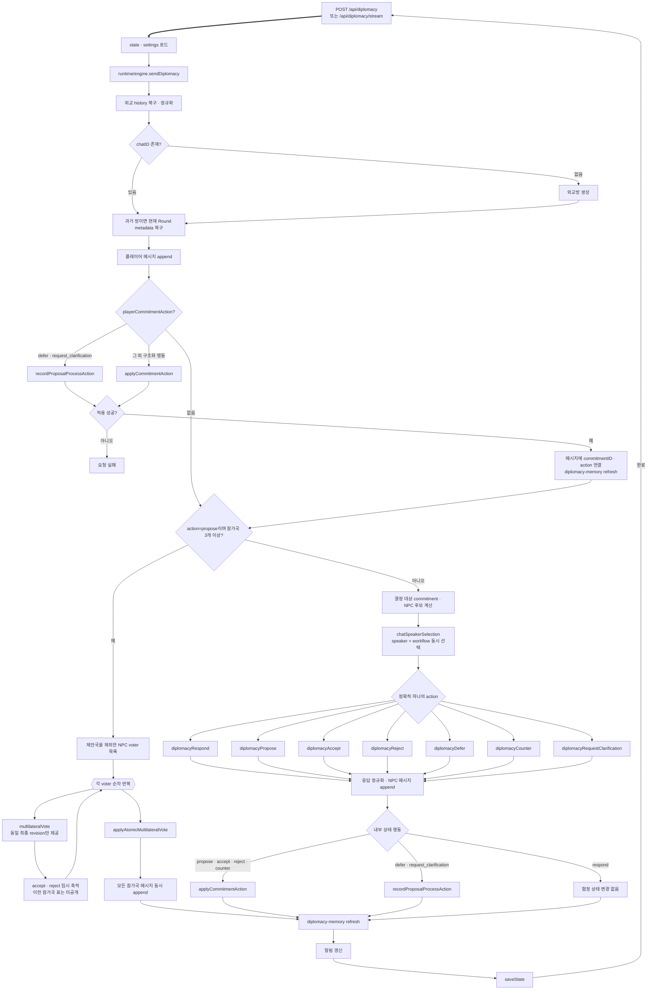

다자 표결은 코드상 순차 반복이지만 각 참가국의 앞선 표를 다음 참가국 프롬프트에 넣지 않습니다. 모든 판단이 끝난 뒤 원자적으로 상태와 메시지를 공개합니다. 사건 후속 연락은 이 흐름과 달리 `eventDiplomacyOutreach → diplomacyRespond`만 실행하며 `chatSpeakerSelection`과 제안·수락·거절 workflow를 거치지 않습니다.

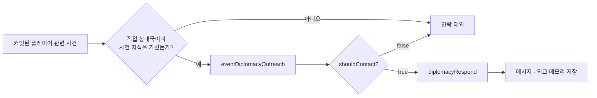

### 13. 협정 revision, 상태 전환, 사건화 관계

협정 대화의 구조화 행동은 `commitments.mjs`가 같은 treaty ID 아래 revision, 참가국 수락, 상태, 공개 범위, 사건화 표식을 관리합니다. 턴 시작의 `commitment-batch.mjs`는 새 합의를 해석하지 않고 기존 협정의 유효일·만료 lifecycle과 국가 탭 표시만 유지합니다.

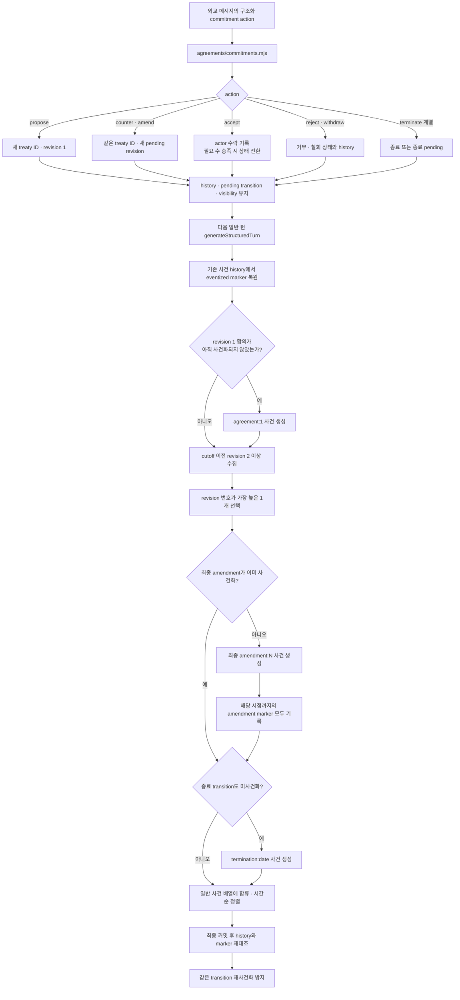

따라서 새 협정의 최초 합의와 다회차 수정이 같은 처리 범위에 함께 있으면 `agreement:1`과 가장 높은 `amendment:N`만 사건 후보가 됩니다. 이미 합의 사건이 존재하는 협정을 여러 번 수정하면 가장 높은 `amendment:N`만 생성하고, 그 이하 revision은 사건화 완료 표식만 기록합니다. 사건의 공개 범위는 협정의 `visibility`를 상속하며, 비공개 사건은 `knownBy`와 당사국 지식 검사를 통해 반응·후속 연락 후보가 제한됩니다.

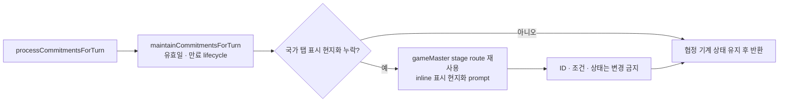

### 14. 최후통첩 생성·판단·시한 처리

플레이어가 보낸 최후통첩은 즉시 저장되고 발신 사건이 현재 라운드에 추가됩니다. NPC의 실질 판단과 시한 경과 처리는 다음 일반 턴의 사전 처리에서 수행됩니다.

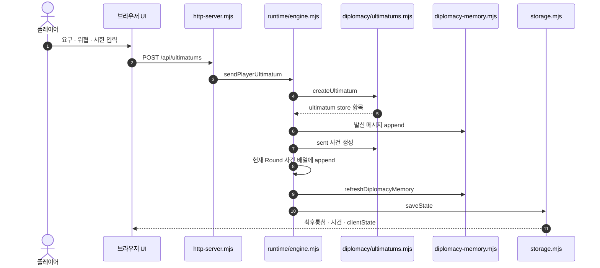

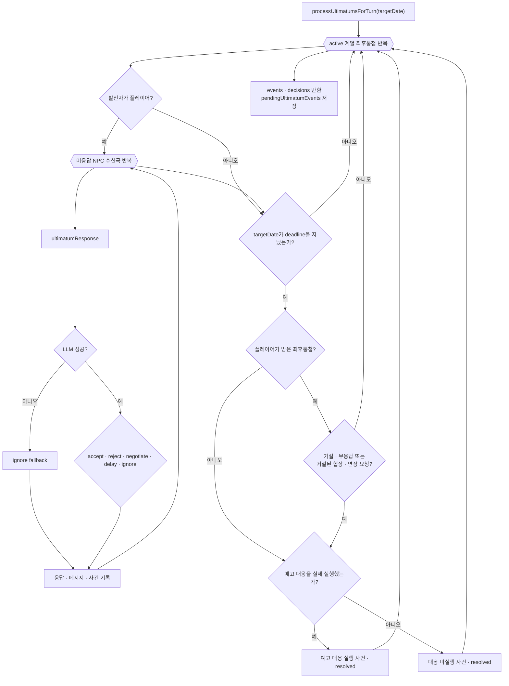

플레이어가 받은 최후통첩에 `negotiate` 또는 `delay`로 답하면, 턴 진행을 기다리지 않고 발신국의 연장 수락 여부를 별도로 판단합니다.

```mermaid
flowchart LR
  IncomingResponseAPI["POST /api/ultimatums/:id/respond"] --> StorePlayerResponse["플레이어 response 기록"]
  StorePlayerResponse --> PlayerUltChoice{"response"}
  PlayerUltChoice -->|"accept · reject"| ImmediateResponseEvent["응답 사건 즉시 append"]
  PlayerUltChoice -->|"ignore"| NoVisibleResponse["표시 사건 · 메시지 없음"]
  PlayerUltChoice -->|"negotiate · delay"| ExtensionPrompt["ultimatumExtensionDecision"]
  ExtensionPrompt --> ExtensionDecision{"발신국 결정"}
  ExtensionDecision -->|"accept"| ExtensionAccepted["필요 시 deadline 연장<br/>상태 negotiating 또는 active"]
  ExtensionDecision -->|"reject"| ExtensionRejected["deadline 유지 · 상태 active"]
  ExtensionAccepted --> ExtensionMessages["플레이어 요청 + 발신국 결정 메시지"]
  ExtensionRejected --> ExtensionMessages
  ImmediateResponseEvent --> SaveUltResponse["외교 memory 갱신 · saveState"]
  NoVisibleResponse --> SaveUltResponse
  ExtensionMessages --> SaveUltResponse
```

### 15. 저장·불러오기·`.lhsave` 내보내기 순서

외교 데이터는 단일 `state.json`에 중복 저장하지 않습니다. `saveState()`가 먼저 외교 snapshot을 별도 파일로 나누고, 외교 본문을 제거한 상태만 `state.json`에 원자적으로 기록합니다.

```mermaid
flowchart TB
  SaveStateStart["saveState(runtime state)"] --> ActiveRecord["활성 game record 조회"]
  ActiveRecord --> UpdateRuntimeMeta["updatedAt · scenarioId · engineVersion 갱신"]
  UpdateRuntimeMeta --> BuildDiplomacySnapshot["diplomacy-memory.buildDiplomacySnapshot"]
  BuildDiplomacySnapshot --> WriteDiplomacy["외교 snapshot 분리 저장"]
  WriteDiplomacy --> ThreadsFile[("threads/*.jsonl")]
  WriteDiplomacy --> IndexFiles[("index.json · summaries/*.json")]
  WriteDiplomacy --> CommitmentFile[("commitments.json")]
  WriteDiplomacy --> DocumentFiles[("documents/*.json · index")]
  WriteDiplomacy --> DisclosureFile[("disclosures.json")]
  WriteDiplomacy --> RelationFile[("relations.json")]
  ThreadsFile --> StripDiplomacy["stripDiplomacyForStateFile"]
  IndexFiles --> StripDiplomacy
  CommitmentFile --> StripDiplomacy
  DocumentFiles --> StripDiplomacy
  DisclosureFile --> StripDiplomacy
  RelationFile --> StripDiplomacy
  StripDiplomacy --> StateFile[("state.json atomic write")]
  StateFile --> PlayerActionArchive[("Round별 player-actions archive")]
  PlayerActionArchive --> RecordManifest[("record.json metadata 갱신")]
```

```mermaid
flowchart TB
  LoadStateStart["loadState · activateGameRecord"] --> RecordManifestRead["활성 record manifest 조회"]
  RecordManifestRead --> ReadStateFile["state.json 읽기"]
  ReadStateFile --> RemoveLegacyPrompt["레거시 prompt 필드 제거"]
  RemoveLegacyPrompt --> HasDiplomacyIndex{"외교 index 존재?"}
  HasDiplomacyIndex -->|"예"| ReadDiplomacyFiles["index · thread JSONL · summary · commitment<br/>document · disclosure · relation 읽기"]
  ReadDiplomacyFiles --> HydrateSnapshot["hydrateDiplomacySnapshot"]
  HydrateSnapshot --> OldSnapshot{"구형 snapshot?"}
  OldSnapshot -->|"예"| RewriteSnapshot["새 형식으로 외교 snapshot 재저장"]
  OldSnapshot -->|"아니오"| AttachHierarchy
  RewriteSnapshot --> AttachHierarchy

  HasDiplomacyIndex -->|"아니오"| BuildLegacySnapshot["state 내장 외교 데이터로 snapshot 생성"]
  BuildLegacySnapshot --> HydrateLegacy["hydrate · migration이면 분리 저장"]
  HydrateLegacy --> AttachHierarchy["시나리오 regionHierarchy 누락 시 부착"]
  AttachHierarchy --> AttachOverrides["prompt-overrides.json을 비열거 runtime 값으로 부착"]
  AttachOverrides --> ConsolidationRecovery{"불완전 consolidation 복구?"}
  ConsolidationRecovery -->|"예"| RecoverAndSave["복구 후 state · 외교 · record metadata 재저장"]
  ConsolidationRecovery -->|"아니오"| RuntimeStateReady["완전한 runtime state 반환"]
  RecoverAndSave --> RuntimeStateReady
```

`.lhsave`는 gzip으로 압축한 순차 레코드 스트림입니다. 레코드 종류와 순서는 고정되어 있으며, debug trace는 내보내기 옵션을 켠 경우에만 포함됩니다.

```mermaid
sequenceDiagram
  participant UIExport as 브라우저 UI
  participant HTTPExport as http-server.mjs
  participant Exporter as exportGameRecordStream
  participant RecordFiles as game-records/
  participant Gzip as gzip .lhsave stream

  UIExport->>HTTPExport: GET /api/games/export-file
  HTTPExport->>Exporter: exportGameRecordStream(...)
  Exporter->>RecordFiles: hydrated state · settings · overrides 읽기
  Exporter-->>Gzip: header
  Exporter-->>Gzip: record
  Exporter-->>Gzip: settings
  Exporter-->>Gzip: promptOverrides
  Exporter-->>Gzip: state
  loop checkpoint 파일
    Exporter-->>Gzip: history
  end
  loop 사건 archive 파일
    Exporter-->>Gzip: eventArchive
  end
  loop 행동 archive 파일
    Exporter-->>Gzip: playerActions
  end
  opt includeDebugTraces
    loop debug trace 파일
      Exporter-->>Gzip: debugTrace
    end
  end
  Exporter-->>Gzip: end · count
  Gzip-->>UIExport: 압축된 .lhsave 다운로드
```

가져오기는 `state` 레코드를 만났을 때 새 게임 기록을 만들고 활성화한 뒤 뒤따르는 archive를 기록합니다. 중간에 실패하면 새 기록을 제거하고 이전 활성 기록 포인터를 복원합니다.

### 16. 독립 작업 API와 유지보수 순서

일반 턴 밖에서 실행되는 주요 작업은 다음과 같습니다. `advanceToNextMajorEvent()`는 일반 턴의 effect gate 3개와 `regionResolver`를 거치지 않고, 한 사건을 현재 라운드에 직접 적용합니다. 치트도 `world/reducer.mjs`를 통하지 않고 `world/cheats.mjs`가 현재 라운드 지도 상태를 직접 편집합니다.

```mermaid
flowchart TB
  subgraph RefineFlow["행동 정제"]
    RefineAPI["POST /api/actions/refine"] --> RefineEngine["runtime/engine.refineAction"]
    RefineEngine --> RefinePrompt["descriptionToAction"]
    RefinePrompt --> RefineLLM["llm/runtime.callLLM"]
    RefineLLM -->|"정제 결과"| RefineAPI
  end

  subgraph NextMajorFlow["다음 주요 사건 한 건"]
    NextAPI["POST /api/events/next-major"] --> NextEngine["advanceToNextMajorEvent"]
    NextEngine --> PrepareGeo["prepareDiplomaticGeography · 365일 horizon"]
    PrepareGeo --> AutoPrompt["autoJumpForward — 정확히 1건"]
    AutoPrompt --> NextMapValidation["필요 시 gameMaster 지도 검증"]
    NextMapValidation --> NextApplyMap["승인 mapChange를 현재 Round에 적용"]
    NextApplyMap --> NextEffects["applyEventEffects · 사건 append"]
    NextEffects --> NextOutreach["후속 외교 최대 1건"]
    NextOutreach --> NextSave["알림 · saveState<br/>같은 Round 유지"]
  end

  subgraph AdvisorFlow["비서실"]
    AdvisorAPI["POST /api/advisor"] --> AdvisorEngine["runtime/engine.askAdvisor"]
    AdvisorEngine --> AppendAdvisorUser["사용자 메시지 먼저 append"]
    AppendAdvisorUser --> AdvisorPrompt["chatWithAdvisor<br/>렌더 실패 시 최소 inline fallback"]
    AdvisorPrompt --> AdvisorLLM["llm/runtime.callLLM"]
    AdvisorLLM --> StoreAdvisor["assistant 메시지 · lastLLM 저장"]
    StoreAdvisor --> SaveAdvisor["알림 · saveState"]
  end

  subgraph ConsolidationFlow["사건 기록 통합"]
    ConsolidateAPI["POST /api/consolidate"] --> ValidateRange["Round 범위 · 완료 · 기존 통합 중첩 검증"]
    ValidateRange --> ConsolidatorPrompt["eventConsolidator"]
    ConsolidatorPrompt --> SummaryQuality{"실질적 요약인가?"}
    SummaryQuality -->|"예"| SaveSummary["eventConsolidations 저장"]
    SummaryQuality -->|"아니오"| RepairSummary["같은 stage repair 1회"]
    RepairSummary --> RepairQuality{"repair 통과?"}
    RepairQuality -->|"예"| SaveSummary
    RepairQuality -->|"아니오"| FallbackSummary["결정론적 chronological fallback"]
    FallbackSummary --> SaveSummary
    SaveSummary --> ArchiveEvents["event-archive 저장 · live 사건 배열 비움"]
    ArchiveEvents --> SaveConsolidation["알림 · saveState"]
  end
```

```mermaid
flowchart TB
  CheatAPI["지도 치트 API"] --> LoadCheatState["loadState"]
  LoadCheatState --> CheatType{"치트 종류"}
  CheatType -->|"소유권 변경"| ChangeOwner["world/cheats.changeRegionOwnership"]
  CheatType -->|"지점 생성"| CreateFeature["world/cheats.createCheatFeature"]
  CheatType -->|"지점 수정"| UpdateFeature["world/cheats.updateCheatFeature"]
  CheatType -->|"지점 삭제"| RemoveFeature["world/cheats.removeCheatFeature"]
  ChangeOwner --> ValidateCheat["국가 · 지역 · 입력 검증"]
  CreateFeature --> ValidateCheat
  UpdateFeature --> ValidateCheat
  RemoveFeature --> ValidateCheat
  ValidateCheat --> MutateRound["현재 Round regionsOwned 또는 mapFeatures 직접 변경"]
  MutateRound --> ChangedRegions["서버가 lastMapChangedRegionIDs 기록"]
  ChangedRegions --> SaveCheat["saveState · clientState 반환"]
  ReducerNotUsed["world/reducer 호출 없음"] -.-> MutateRound
  LLMNotUsed["LLM 호출 없음"] -.-> ValidateCheat

  ResetScriptFlow["scripts/maintenance/reset.mjs"] --> InitStorageFlow["persistence/storage.initStorage"]
  InitStorageFlow --> ResetStateFlow["persistence/storage.resetState"]
  ResetStateFlow --> ResetFiles[("초기 저장 상태")]

  ScenarioSource[("시나리오 원본 · 수동 override")] --> ScenarioGenerator["scripts/scenario-data/<br/>generate_complete_diplomacy_2026_07_21.py"]
  ScenarioGenerator --> ScenarioData[("diplomacy.json · profiles · audit 산출물")]
```

### 17. 전체 실행 순서 요약

관계도와 세부 순서도를 한 줄로 압축하면 다음과 같습니다.

```mermaid
flowchart LR
  UserFlow["사용자 입력"] ==> ServerBoundary["server/http-server"]
  ServerBoundary --> RuntimeCoordinator["runtime/engine"]
  RuntimeCoordinator --> DomainChoice{"작업 종류"}
  DomainChoice --> ActionsDomain["actions"]
  DomainChoice --> EventsDomain["events"]
  DomainChoice --> DiplomacyDomainSummary["diplomacy"]
  DomainChoice --> WorldDomain["world"]
  EventsDomain --> SimulationDomain["simulation"]
  DiplomacyDomainSummary --> SimulationDomain
  ActionsDomain --> StateMutation["working state 또는 실제 state 변경"]
  EventsDomain --> StateMutation
  DiplomacyDomainSummary --> StateMutation
  WorldDomain --> StateMutation
  RuntimeCoordinator --> PromptRender["prompts/runtime"]
  PromptRender --> LLMCall["llm/runtime → provider"]
  LLMCall -->|"모델 결과"| RuntimeCoordinator
  StateMutation --> ReadModels["country · core state views"]
  ReadModels --> Persist["persistence/storage"]
  RuntimeCoordinator -.-> Observe["observability trace · GPU"]
  Persist -->|"저장 결과"| ServerBoundary
  ServerBoundary ==>|"authoritative state"| UserFlow
```

## 모듈 계층과 의존 방향

일반적인 호출 방향은 다음과 같습니다.

```text
server/http-server
→ runtime/engine
→ actions | events | diplomacy | simulation | world
→ state 조회·reducer | prompts/runtime | llm/runtime
→ persistence | observability | core
```

규칙은 다음과 같습니다.

1. `server/`는 HTTP 요청과 응답, 상태 로드·저장, 스트림 진행률을 조율합니다. 게임 규칙을 직접 구현하지 않습니다.
2. `runtime/engine.mjs`는 공개 애플리케이션 작업을 조율합니다. 실제 외교·사건·세계 규칙은 각 기능 폴더에 둡니다.
3. `prompts/`는 프롬프트 템플릿과 컨텍스트 렌더링을 담당합니다. provider 통신은 `llm/`이 담당합니다.
4. `persistence/`는 디스크 형식과 시나리오 설치 계약을 담당합니다. 게임 효과 판단을 하지 않습니다.
5. `core/`는 기능 의미를 모르는 공통 코드만 둡니다.
6. 현재 `prompts/runtime.mjs → world/region-resolution.mjs → llm/runtime.mjs → prompts/runtime.mjs` 순환이 존재합니다. 모듈 평가 순서를 바꾸는 배럴 `index.mjs`를 만들지 말고 실제 파일을 직접 import합니다.

## 서버 시작 순서

```text
npm start / start.bat / start.sh
1. 루트 server.mjs가 src/server/http-server.mjs를 import
2. ESM 의존 그래프 평가
   - runtime/engine.mjs
   - events/event-generation.mjs
   - prompts/runtime.mjs
   - prompts/registry.mjs와 28개 프롬프트 모듈
   - data/schemas/jump-forward.json 읽기
3. initStorage()
   - 시나리오 시스템 초기화
   - game-records와 활성 기록 확인
   - 레거시 기록 마이그레이션
   - 전역 settings 초기화·정규화
4. initProviderStore()
   - data/config/providers.json 초기화·정규화
5. 지도 geometry loader 생성
6. HTTP 서버 listen
```

ESM 모듈 평가는 `initStorage()`보다 먼저 일어납니다. `runtime/engine.mjs`와 `events/event-generation.mjs`가 `data/schemas/jump-forward.json`을 프로젝트 루트 기준으로 읽기 때문에 다른 작업 디렉터리에서 하위 서버 파일을 직접 실행하지 않습니다.

## 브라우저 초기화 순서

```text
GET /
→ public/index.html
→ /css/styles.css
→ /js/app.js
→ /js/ui-helpers.js
→ launcher 데이터 요청
   - GET /api/launcher
→ 새 게임 생성 또는 기존 기록 활성화
→ 전체 게임 화면 데이터 요청
   - GET /api/state
   - GET /api/settings
   - GET /api/map-geometry
   - GET /api/scenarios
   - GET /api/providers
   - GET /api/prompts
→ 지도·행동·사건·국가·외교·비서실 화면 렌더링
→ GPU 상태와 실행 진행률 폴링
```

브라우저는 authoritative state를 직접 수정하지 않습니다. 모든 변경은 API를 거쳐 서버 상태에 반영되고 저장된 뒤 다시 클라이언트 읽기 모델로 변환됩니다.

## 새 게임과 기록 불러오기

새 게임:

```text
POST /api/games/new
→ persistence/scenarios.mjs에서 시나리오 정의 로드
→ persistence/storage.mjs에서 새 game record 생성
→ scenario의 game·round1·world·map·diplomacy 결합
→ 활성 기록 포인터 변경
→ 완전한 clientState 반환
```

기존 기록 불러오기:

```text
활성 record 확인
→ state.json 읽기
→ 레거시 내장 프롬프트 registry 제거
→ diplomacy/ 하위 스냅샷 읽기
→ 외교 threads·summaries·documents·commitments·relations hydrate
→ 필요한 외교 형식 migration
→ scenario region hierarchy 부착
→ prompt-overrides.json을 비열거 런타임 값으로 부착
→ 완전한 state 반환
```

`state.json`만 단독으로 읽으면 완전한 외교 상태가 아닙니다. 외교 데이터는 기록 폴더의 `diplomacy/`와 결합해야 합니다.

## 행동 등록과 구체화

일반 행동 등록:

```text
UI 행동 입력
→ POST /api/actions
→ runtime/engine.registerActionInput()
→ 입력에서 *시스템 사건 지시* 분리
→ 나머지 입력을 다음 중 하나로 등록
   - 즉시 플레이어 행동
   - 실행일이 있는 예약 행동
   - 조건이 있는 조건부 행동
→ persistence/storage.saveState()
→ 새 clientState 반환
```

행동 설명 구체화:

```text
POST /api/actions/refine
→ runtime/engine.refineAction()
→ prompts/actions/descriptionToAction.mjs 렌더링
→ llm/runtime.callLLM(stage=descriptionToAction)
→ action 또는 chat으로 분류
→ 실행 설명과 참가국 정규화
→ 결과 반환
```

예약 행동은 턴 시작 시 목표 날짜까지 기한이 도달한 항목만 현재 라운드 행동으로 물질화합니다. 조건부 행동은 초기 국제 사건이 모두 적용된 뒤, 반응 사건을 만들기 전에 조건을 검사합니다.

## 일반 턴 진행 전체 순서

### 1. 서버 경계

```text
POST /api/turn 또는 /api/turn/stream
→ state와 settings 로드
→ 활성 기록 확인
→ 현재 라운드 checkpoint 생성
→ observability/debug-trace.runWithTurnDebugTrace()
→ runtime/engine.advanceTurn()
→ 알림 갱신
→ state 저장
→ 완료 결과 또는 NDJSON 진행률 반환
```

### 2. `advanceTurn()` 사전 처리

```text
1. 목표 날짜 형식·달력·현재 날짜 이후 여부 검증
2. diplomacy/agreements/commitment-batch.processCommitmentsForTurn()
   - 협정 lifecycle과 만료 유지
   - 필요한 국가 탭 표시 현지화
3. actions/action-scheduling.materializeDueScheduledActions()
4. diplomacy/ultimatums.processUltimatumsForTurn()
   - NPC 수신 최후통첩 판단
   - 시한 만료와 응답 사건 준비
5. 실제 state를 복제해 workingState 생성
```

`commitment-batch.mjs`의 표시 현지화 호출은 현재 별도 stage가 없어서 `gameMaster`의 모델 경로를 재사용합니다. 이는 저장 설정 호환성을 유지하기 위한 현재 예외입니다.

### 3. 구조화 사건 생성

`events/event-generation.generateStructuredTurn()`은 다음 순서로 실행됩니다.

```text
1. 외교 지리 인접성과 관계 컨텍스트 준비

2. 시스템 사건 지시 처리
   countryResolver
   → regionResolver
   → systemEventEvents
   → 사건별 지도·효과 검증 및 workingState 즉시 적용

3. 플레이어 행동 결과 처리
   countryResolver
   → regionResolver
   → playerActionEvents
   → 사건별 지도·효과 검증 및 workingState 즉시 적용

4. 결정론적 사건 추가
   - proposal이 없는 일반 외교 대화 결과
   - 협정 revision·상태 전환 결과
   - 최후통첩 결과

5. 현재까지 실제로 적용된 날짜만큼 현안 중요도 전진

6. 전 국가 Active Plan 스캔
   → simulation/strategic-plans.mjs
   → NPC 이니셔티브 후보 예약

7. 국제 사건 후보와 플레이어 행동 footprint 구성

8. internationalEventPlanner
   → 사건 뼈대, 행위자, 날짜, 인과 링크 생성

9. regionResolver
   → 뼈대의 지역명과 ID canonicalization

10. 코드 1차 검증
    - 날짜 범위
    - 기존 외교 상태와 모순
    - 행동 결과 중복
    - 슬롯·행위자·인과 조건

11. 누락되거나 탈락한 뼈대는 같은 planner stage로 제한 재생성

12. 초기 사건을 날짜순으로 정렬하고 두 배치로 분할

13. internationalEventDetails 초기 배치 1
    → 코드 2차 검증
    → 필요 시 detail repair
    → GameMaster 지도 판정
    → 효과를 workingState에 즉시 적용

14. internationalEventDetails 초기 배치 2
    → 배치 1에서 해결된 사건을 컨텍스트에 포함
    → 동일한 검증·수리·지도 판정·효과 적용

15. conditionalActionScan
    → 초기 사건까지 포함해 각 조건부 행동의 충족 여부 판단

16. 충족된 항목마다 conditionalActionEvents
    → 결과 사건 생성
    → 지도·효과 검증 및 적용

17. 반응 원본 선택
    → 공개 사건 또는 해당 행위자가 알 수 있는 사건만 허용
    → 비밀 사건의 비당사국 컨텍스트 유입 차단

18. reactionIntent
    → 국가별 반응 유형, 강도, 대상, 행동관계 점수 결정

19. reactionEvents 단일 상세 배치
    → 코드 2차 검증·수리
    → GameMaster 지도 판정
    → workingState 적용

20. 목표 날짜까지 도달한 프로젝트 완료 사건 생성·적용
21. 현안 중요도를 목표 날짜까지 전진
22. 전 국가 전략계획 최종 스캔
23. 모든 사건을 시간순 정렬
24. 파이프라인 메타데이터, LLM 사용량, 프롬프트 로그 반환
```

`jumpForward` stage는 이 흐름 전체를 한 번 호출하는 모델 단계가 아닙니다. 시스템 사건, 플레이어 행동, 국제 사건 상세화 등에 공통 기반 컨텍스트를 제공하는 프롬프트입니다. 다음 주요 사건 하나만 진행하는 별도 기능은 `autoJumpForward` stage를 사용합니다.

### 4. 사건 한 건의 검증·적용 순서

지도 변경 가능성이 있는 각 생성 사건은 전체 턴 끝이 아니라 자신의 날짜 순서에서 즉시 다음 과정을 거칩니다.

```text
events/effects/effect-gates
→ 해소된 지역 역할 검사
→ 플레이어 행동 범위 검사
→ 필수 외교 상태 implication 보충
→ prompts/turn/resolution/gameMaster.mjs
→ 제안된 mapChanges의 승인·교정·거부
→ world/reducer.applyMapChange()
→ events/effects/effect-engine.applyEventEffects()
→ workingState의 사건 기록·지도 revision·현재 날짜 갱신
→ 다음 사건의 LLM 컨텍스트로 사용
```

따라서 `gameMaster`는 턴 마지막에 한 번 실행되는 모듈이 아니라 지도 변경 가능성이 있는 사건마다 반복 실행됩니다.

### 5. 실제 라운드 커밋

working state에서 모든 사건이 검증된 뒤 실제 state에 다음 순서로 커밋합니다.

```text
world/reducer.applyEvents()
→ 다음 라운드 국가·지도 상태 생성
→ 각 사건에 effect-engine 적용
→ 현안과 프로젝트를 목표 날짜까지 전진
→ 사건 정보 노출 이력 기록
→ 현재 라운드 completed=true
→ 다음 라운드 생성
→ lastRoundCompleted와 runtime.currentDate 갱신
→ 협정 사건화 표식 reconcile
```

### 6. 사건 후속 외교 연락

라운드 커밋 후 최대 두 건의 후속 연락을 생성합니다.

```text
커밋된 사건
→ 플레이어 연관 여부 검사
→ 직접 상대국 후보 계산
→ 사건 정보 가시성과 협정 당사국 여부 검사
→ prompts/diplomacy/outreach/eventDiplomacyOutreach.mjs
→ 연락 필요 여부와 목적 판단
→ 기존 직접 채팅방 또는 새 채팅방 선택
→ diplomacyRespond 흐름으로 메시지 생성
→ 외교 메모리·알림 저장
```

비밀로 라벨링된 사건은 비당사국 반응·후속 외교 컨텍스트에서 제외합니다. 협정 체결 보고를 본 당사국의 후속 연락은 새 협상이나 재제안이 아니라 이행 조율과 내용 명확화로 제한됩니다.

## 다음 주요 사건 한 건 진행

```text
POST /api/events/next-major 또는 스트림 경로
→ runtime/engine.advanceToNextMajorEvent()
→ prompts/turn/autoJumpForward.mjs
→ 정확히 한 건의 가장 이른 주요 사건 생성
→ 필요한 경우 GameMaster 지도 검증
→ 승인된 mapChanges에 world/reducer.applyMapChange()
→ events/effects/effect-engine.applyEventEffects()
→ 현재 state에 즉시 적용
→ 사건 후속 외교 연락 최대 한 건
→ 저장
```

이 기능은 일반 턴처럼 목표 날짜까지 다수 사건을 생성하거나 라운드를 종료하지 않습니다. 현재 경로에서는 일반 턴의 효과 gate 3개와 `regionResolver`를 호출하지 않습니다.

## 외교 실행 순서

### 양자·일반 다자 대화

```text
UI 외교 메시지 또는 Proposal
→ POST /api/diplomacy/stream
→ runtime/engine.sendDiplomacy()
→ 외교 기록 복구·정규화
→ 플레이어 메시지 추가
→ 선택한 commitment action이 있으면 즉시 검증·적용
→ 유효한 NPC 응답 후보 계산
→ chatSpeakerSelection
→ 선택된 행동을 diplomacy/diplomacy-workflow.mjs로 전달
→ 다음 중 정확히 한 stage 실행
   - diplomacyRespond
   - diplomacyPropose
   - diplomacyAccept
   - diplomacyReject
   - diplomacyDefer
   - diplomacyCounter
   - diplomacyRequestClarification
→ NPC 메시지와 기계 판정 정규화
→ commitment revision 또는 절차 행동 반영
→ diplomacy-memory 재생성
→ 알림 갱신과 저장
```

`chatSpeakerSelection`은 발언자뿐 아니라 실행할 외교 행동을 선택합니다. 이후 워크플로 프롬프트는 선택을 다시 판단하지 않고 해당 행동을 수행합니다.

### 다자 협정 동시 표결

플레이어가 제출한 협정 제안 참가자가 3개국 이상이면 일반 발언자 선택을 건너뜁니다.

```text
플레이어 proposal revision 적용
→ diplomacy/agreements/multilateral-vote.resolveMultilateralVote()
→ 각 NPC가 동일한 최종 revision을 독립적으로 평가
→ 어떤 NPC도 다른 참가국의 표를 보지 않음
→ 모든 판정 완료
→ commitments.applyAtomicMultilateralVote()
→ 참가국별 수락·거부 메시지를 한꺼번에 공개
→ diplomacy-memory 갱신과 저장
```

### 협정 상태와 사건화

```text
외교 메시지의 proposal/counter/amend/accept/reject 등
→ diplomacy/agreements/commitments.mjs
→ 같은 treaty ID 아래 revision과 상태 갱신
→ 턴 생성 시 pending transition 조회
→ 최초 합의와 필요한 최종 revision만 결정론적 사건으로 생성
→ 사건 기록에 반영된 transition 표식 저장
```

이미 과거에 사건화된 협정을 같은 턴에 여러 번 수정한 경우에는 마지막 amendment revision만 사건 후보가 됩니다. 별도 proposal이 없는 일반 외교 대화의 유의미한 결과는 `diplomatic-outcome-events.mjs`가 사건화합니다.

### 최후통첩

발신:

```text
POST /api/ultimatums
→ diplomacy/ultimatums.createUltimatum()
→ 발신 메시지·요구·기한·가시성 저장
```

NPC 수신국 판단:

```text
다음 턴 시작
→ processUltimatumsForTurn()
→ 각 수신국에 ultimatumResponse
→ 수락·거부·협상·연장 요청 판단
→ 결과와 사건 준비
```

플레이어가 받은 최후통첩에 협상 또는 연장을 요청한 경우:

```text
플레이어 응답
→ ultimatumExtensionDecision
→ 발신국의 수락·거부 결정
→ 외교 메시지와 최후통첩 상태 갱신
```

## 비서실 실행 순서

```text
POST /api/advisor 또는 스트림 경로
→ runtime/engine.askAdvisor()
→ prompts/advisor/chatWithAdvisor.mjs
→ 세계 사건, 구조화 외교 관계, 플레이어에게 보이는 외교 기록 조합
→ llm/runtime.callLLM(stage=chatWithAdvisor)
→ 일반 텍스트 응답 저장
```

시스템 프롬프트 렌더링이 실패한 경우에도 engine에 있는 최소 fallback 컨텍스트로 응답을 시도합니다.

## 사건 기록 통합 순서

```text
POST /api/consolidate
→ 지정 라운드 범위의 사건 원문 수집
→ prompts/history/eventConsolidator.mjs
→ 구조화 summary 생성
→ 코드 품질 검사
→ 지나치게 짧거나 제목뿐이면 같은 stage로 repair 1회
→ 다시 실패하면 결정론적 요약 fallback
→ 원본 사건 archive
→ 통합 기록과 플레이어 행동 archive를 분리 저장
```

플레이어 행동은 사건 통합 원문에 섞지 않으며 독립된 `player-actions` 기록으로 유지합니다.

## 치트와 지도 편집

```text
치트 API
→ world/cheats.mjs
→ 국가·지역 존재 여부와 대상 검증
→ 현재 Round의 소유권 또는 지도 point 직접 변경
→ server/http-server.mjs가 lastMapChangedRegionIDs 기록
→ 저장과 clientState 반환
```

치트 편집은 `world/reducer.mjs`와 LLM을 호출하지 않습니다. 현재 구현은 이 경로에서 `mapRevision`을 증가시키지 않습니다.

## 저장·내보내기 순서

일반 저장:

```text
런타임 state
→ diplomacy-memory.buildDiplomacySnapshot()
→ diplomacy/threads·summaries·documents·commitments·relations 분리 저장
→ state 파일에서 중복 외교 본문 제거
→ state.json 저장
→ 플레이어 행동 라운드 archive 저장
→ record.json의 날짜·라운드·수정시각 갱신
```

`.lhsave` 내보내기는 기록 메타데이터, state, 외교 스냅샷, 프롬프트 override, 필요한 archive를 하나의 스트림으로 묶습니다. 디버그 추적은 명시적 진단 내보내기를 선택한 경우에만 포함합니다.

## 공통 LLM 호출 순서

모든 stage는 대체로 다음 공통 경로를 사용합니다.

```text
prompts/runtime.mjs
→ 시스템 기본 프롬프트 조회
→ 게임 기록별 prompt override 병합
→ 현재 state와 optionalData로 helper/context 구성
→ 템플릿 변수 치환
→ llm/runtime.mjs
→ stage별 route와 전역 provider 설정 결합
→ provider 호출
→ JSON schema 파싱
→ 실패 시 JSON repair 또는 stage별 안전 fallback
→ 외교 machine field 검증과 반복·손상 메시지 정제
→ LLM 사용량과 debug trace 기록
→ 기능 모듈의 코드 검증
→ state 반영
```

프롬프트 파일 밖의 복구 지시문도 존재합니다.

- `events/event-generation.mjs`: planner 재생성, detail·reaction repair
- `runtime/engine.mjs`: 사건 후속 외교 역할 제한, 비서실 fallback, 기록 통합 repair
- `llm/runtime.mjs`: JSON 복구, 빈 응답 복구, 외교 machine field·반복 응답 재시도
- `diplomacy/agreements/commitment-batch.mjs`: 국가 탭 표시 현지화

이들은 해당 호출부의 검증 상태와 밀접하게 결합되어 있으므로 현재는 호출 모듈에 둡니다.

## 프롬프트 모듈 28개

`stage` 문자열은 파일명이 아니라 저장 호환성을 갖는 영속 API 키입니다. `data/config/settings.json`, 게임 기록의 `prompt-overrides.json`, 세이브 파일, 사용량 기록, 디버그 추적에서 동일한 키를 사용하므로 파일을 이동하더라도 stage 이름을 변경하지 않습니다.

| 레지스트리 stage | 파일 | 실제 역할과 호출 시점 |
|---|---|---|
| `jumpForward` | `src/prompts/turn/jumpForward.mjs` | 정상 턴의 공통 세계·라운드 기반 컨텍스트. 독립 단일 호출이 아님 |
| `playerActionEvents` | `src/prompts/turn/actions/playerActionEvents.mjs` | 플레이어 행동별 직접 결과 사건 생성 |
| `systemEventEvents` | `src/prompts/turn/actions/systemEventEvents.mjs` | 별표 시스템 사건 지시를 authoritative 사건으로 변환 |
| `internationalEventPlanner` | `src/prompts/turn/events/internationalEventPlanner.mjs` | 국제 사건 뼈대·날짜·인과 관계 계획 및 제한 재생성 |
| `internationalEventDetails` | `src/prompts/turn/events/internationalEventDetails.mjs` | 초기 국제 사건 두 배치의 상세화와 필요 시 수리 |
| `reactionIntent` | `src/prompts/turn/reactions/reactionIntent.mjs` | 국가별 반응 방향·강도·대상·관계 점수 판정 |
| `reactionEvents` | `src/prompts/turn/reactions/reactionEvents.mjs` | 모든 반응 뼈대의 최종 상세 사건 생성 |
| `regionResolver` | `src/prompts/world/resolution/regionResolver.mjs` | 지역 언급을 canonical region ID로 변환하고 모호성 보고 |
| `countryResolver` | `src/prompts/world/resolution/countryResolver.mjs` | 국가 별칭과 현지명을 canonical polity 이름으로 변환 |
| `gameMaster` | `src/prompts/turn/resolution/gameMaster.mjs` | 사건별 실효 지배·지도 변경 승인, 교정, 거부 |
| `eventDiplomacyOutreach` | `src/prompts/diplomacy/outreach/eventDiplomacyOutreach.mjs` | 커밋된 사건 뒤 직접 상대국의 연락 필요성과 목적 판정 |
| `autoJumpForward` | `src/prompts/turn/autoJumpForward.mjs` | 라운드 종료 없이 가장 이른 주요 사건 정확히 한 건 생성 |
| `chatSpeakerSelection` | `src/prompts/diplomacy/workflow/chatSpeakerSelection.mjs` | 외교방의 NPC 발언자와 실행 workflow를 함께 선택 |
| `diplomacyRespond` | `src/prompts/diplomacy/workflow/diplomacyRespond.mjs` | 일반 응답 또는 사건 후속 조율·명확화 |
| `diplomacyPropose` | `src/prompts/diplomacy/workflow/diplomacyPropose.mjs` | NPC의 새 구조화 협정 제안 |
| `diplomacyAccept` | `src/prompts/diplomacy/workflow/diplomacyAccept.mjs` | 대상 협정 revision 수락 |
| `diplomacyReject` | `src/prompts/diplomacy/workflow/diplomacyReject.mjs` | 대상 협정 revision 거부 |
| `diplomacyDefer` | `src/prompts/diplomacy/workflow/diplomacyDefer.mjs` | 결정 유보와 사유 제시 |
| `diplomacyCounter` | `src/prompts/diplomacy/workflow/diplomacyCounter.mjs` | 대상 revision에 대한 구조화 수정안 생성 |
| `diplomacyRequestClarification` | `src/prompts/diplomacy/workflow/diplomacyRequestClarification.mjs` | 특정 조건의 명확화 질문 생성 |
| `chatWithAdvisor` | `src/prompts/advisor/chatWithAdvisor.mjs` | 비서실의 세계·외교 상태 기반 답변 |
| `descriptionToAction` | `src/prompts/actions/descriptionToAction.mjs` | 자연어 입력을 action/chat과 참가국으로 정규화 |
| `eventConsolidator` | `src/prompts/history/eventConsolidator.mjs` | 지정 라운드 사건의 연대기적 통합 요약 |
| `conditionalActionScan` | `src/prompts/turn/actions/conditionalActionScan.mjs` | 조건부 행동의 현재 충족 여부와 최초 충족일 판단 |
| `conditionalActionEvents` | `src/prompts/turn/actions/conditionalActionEvents.mjs` | 충족된 조건부 행동의 직접 결과 사건 생성 |
| `ultimatumResponse` | `src/prompts/diplomacy/ultimatums/ultimatumResponse.mjs` | NPC 수신국의 수락·거부·협상·연장 요청 판단 |
| `ultimatumExtensionDecision` | `src/prompts/diplomacy/ultimatums/ultimatumExtensionDecision.mjs` | 발신국의 협상·시한 연장 요청 수락 여부 판단 |
| `multilateralVote` | `src/prompts/diplomacy/agreements/multilateralVote.mjs` | 동일 최종 revision에 대한 각 NPC의 독립 표결 |

`src/prompts/registry.mjs`의 배열 순서는 프롬프트 편집기 표시와 기본 설정 등록을 위한 순서입니다. 위의 턴·외교 실행 절차가 실제 호출 순서입니다.

## 데이터와 저장 경로 계약

다음 경로는 코드 위치와 무관하게 프로젝트 루트 기준으로 유지합니다.

| 경로 | 용도 |
|---|---|
| `data/config/settings.json` | UI 언어, 출력 언어, stage별 모델 route |
| `data/config/providers.json` | provider profile과 비밀 참조 |
| `data/runtime/active-scenario.json` | 활성 시나리오 ID |
| `data/runtime/active-game-record.json` | 활성 게임 기록 ID |
| `data/schemas/jump-forward.json` | 턴 사건 구조화 출력 schema |
| `scenarios/<id>/` | 시나리오 manifest와 game·round1·world·map·diplomacy |
| `game-records/<id>/` | state, 외교, archive, prompt override, 선택적 debug trace |

시나리오 발견 단계는 각 시나리오 폴더 바로 아래의 `game.json`과 `round1.json`을 요구합니다. 시나리오 데이터 내부를 임의로 다시 중첩하지 않습니다.

## 테스트 구조와 검증 순서

테스트 파일은 경로 깊이를 전제로 하는 회귀 검사가 많으므로 `tests/` 바로 아래에 유지합니다. 프로덕션 모듈과 UI 자산을 직접 import하거나 파일 본문을 읽는 테스트는 새 디렉터리 경로를 기준으로 합니다.

구조 변경 후 권장 검증 순서는 다음과 같습니다.

```text
1. 모든 .mjs와 .js 구문 검사
2. 모든 상대 import 대상 존재 여부 검사
3. LLM·provider·지도 로더 단위 테스트
4. UI 자산과 소스 계약 테스트
5. 전체 npm test
6. 서버 시작 후 정적 파일과 읽기 전용 API 스모크 테스트
   - /
   - /css/styles.css
   - /js/app.js
   - /js/ui-helpers.js
   - /api/health
   - /api/launcher
   - /api/state
   - /api/map-geometry
   - /api/prompts
```

`scenario.test.mjs`와 reset 스크립트는 실제 런타임 선택·기록을 변경할 수 있으므로 단순 경로 검사 용도로 실행하지 않습니다.

## 새 모듈을 추가하는 기준

- HTTP route와 전송 형식만 다루면 `src/server/`
- 여러 기능을 연결하는 애플리케이션 작업이면 `src/runtime/`
- 행동 예약·조건 판정이면 `src/actions/`
- 사건 생성·검증·효과면 `src/events/`
- 관계·대화·협정·최후통첩이면 `src/diplomacy/`
- 현안·프로젝트·NPC 장기계획이면 `src/simulation/`
- 지도·지역·라운드 상태 변환이면 `src/world/`
- 국가 탭용 표시 읽기 모델이면 `src/country/`
- 파일·시나리오·설정 저장이면 `src/persistence/`
- provider 통신·schema 복구·LLM 사용량이면 `src/llm/`
- 프롬프트 템플릿 또는 프롬프트 렌더링이면 `src/prompts/`의 해당 기능 하위 폴더
- 추적·성능·하드웨어 관측이면 `src/observability/`
- 기능 의미를 갖지 않는 공통 순수 함수만 `src/core/`

새 프롬프트 stage를 추가할 때는 템플릿 파일, `src/prompts/registry.mjs`, 기본 settings route, 프롬프트 편집기 메타데이터, schema·fallback, 저장 migration, 테스트를 함께 갱신합니다. 기존 stage 이름 변경은 alias와 저장 데이터 migration 없이 수행하지 않습니다.
